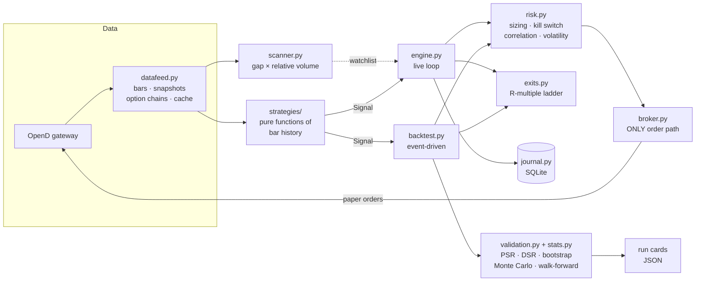

# moobot — an algorithmic trading system for moomoo / Futu OpenAPI

An end-to-end systematic trading system: signal generation, risk-managed
position sizing, an R-multiple exit ladder, a no-lookahead event-driven
backtester, and a statistical validation suite that tries hard to prove its own
backtests wrong.

It trades US / HK / SG equities and equity options against a **paper account**.
The safety model makes reaching real money require three independent deliberate
actions.

---

## Why this project is interesting

Most retail trading bots are an indicator plus an order call. The signal is the
easy part and it is not where money is won or lost. The engineering here is
concentrated in the four places that actually decide the outcome:

| Concern | Approach |
|---|---|
| **Execution realism** | Signals fill at the *next* bar's open, never the signal bar's close. Gaps fill through the stop, not at it. Stops win ties against targets. Every shortcut that inflates a backtest is closed deliberately, and there is a regression test for each. |
| **Trade management** | Positions are managed in **R** — multiples of the capital actually risked — with a scale-out → breakeven → trailing-stop state machine shared bit-for-bit between the backtester and the live engine. |
| **Position sizing** | Fixed-fractional sizing off the stop distance, optionally volatility-targeted so risk stays constant across regimes, with the Kelly criterion computed as a sanity ceiling. |
| **Statistical honesty** | Probabilistic and Deflated Sharpe ratios, bootstrapped confidence intervals, Monte Carlo trade reshuffling, and anchored walk-forward with an embargo. The system charges itself for every parameter combination it tries. |

The trading strategies themselves are deliberately classic (MA crossover, RSI
reversion, Donchian breakout, MACD). They are interchangeable plug-ins. The
value is in the machinery around them.

---

## Architecture



The critical invariant: **`strategies/` and `exits.py` are shared by the
backtester and the live engine.** A strategy is a pure function of bar history —
it cannot read the account, place an order, or hold mutable state. That is what
makes "the backtest and live trading agree" a structural property rather than a
hope.

---

## The algorithms

### 1. Position sizing

Quantity is derived from the distance to the stop, so every trade risks the same
fraction of equity regardless of the instrument's price:

```
             equity × risk_per_trade% × signal_strength × volatility_scale
quantity =  ─────────────────────────────────────────────────────────────
                          entry_price − stop_price
```

then capped by `max_position_pct` of equity and by available cash net of a
reserve buffer.

**Volatility targeting.** Risking a flat 1% is not regime-neutral: in turbulent
markets the stop is further away *and* far likelier to be gapped through, so the
same nominal bet is a much larger real one. The scale factor

$$\text{volScale}=\min\!\left(\frac{\sigma_{\text{target}}}{\sigma_{\text{realised}}},\ \text{maxScale}\right)$$

halves size when volatility doubles. Scaling *up* is capped, because calm
markets end abruptly. Measured on a synthetic series with clustered volatility —
identical entries, identical 27 trades, only the sizing differs:

| Sizing | Return | Max drawdown | Sharpe |
|---|---|---|---|
| Fixed fractional | +0.99% | −3.46% | 0.10 |
| Volatility targeted (20%) | **+1.36%** | **−3.11%** | **0.16** |

**Kelly as a ceiling.** `validate` solves for the growth-optimal fraction from
the observed R distribution by maximising $\mathbb{E}[\log(1+fR)]$ via ternary
search on the concave objective, constrained to $f < 1/|\min R|$ so a single
worst-case loss cannot wipe the account out. It is reported, not applied —
full Kelly is far too aggressive in practice, but knowing you are *above* it is
important, because that is the one regime where you get lower growth **and**
higher risk simultaneously.

### 2. The exit ladder

Everything is denominated in **R**, where 1R is the capital risked on the trade
(entry − initial stop). The initial stop is frozen at entry and never moves with
the trailing stop, so R stays a fixed denominator.

```
     ┌──────────┐  price ≥ +0.75R   ┌───────────┐  price ≥ +1R   ┌──────────────┐
     │  opened  │ ────────────────► │  partial  │ ─────────────► │  breakeven   │
     │ stop=-1R │   sell ~⅓         │   taken   │   stop→entry   │  + trailing  │
     └──────────┘                   └───────────┘                └──────────────┘
           │                              │                             │
           └──── stop hit: −1R ───────────┴───────── target +3R ────────┘
```

The trailing stop ratchets **up only** and supports ATR, percentage, and
swing-low methods. Measured on the bundled sample — same strategy, same 16
entries, only the exit logic differs:

| Exits | Scale-outs | Return | Max drawdown | Win rate | Expectancy |
|---|---|---|---|---|---|
| Flat stop / target | 0 | +0.43% | −3.43% | 37.5% | +0.057R |
| **Ladder** | 10 | **+1.98%** | **−1.39%** | **68.8%** | **+0.202R** |

Same signals, over 4× the return at 40% of the drawdown. Exit logic, not entry
logic, is where the difference lives.

### 3. Execution model in the backtester

Deliberately pessimistic, because every one of these shortcuts silently
manufactures profit:

- A signal computed from bar *i*'s close fills at bar *i+1*'s **open**
- Slippage applied adversely on both sides, plus per-share commission with a minimum
- Stops and targets are checked against each bar's high/low range, not its close
- A gap through the stop fills at the **open**, not at the stop price
- When a bar's range covers both the stop and a profit level, the **stop is assumed to win**
- Scale-outs, breakeven flips and trailing stops all route through the same `ExitLadder` object the live engine uses

### 4. Statistical validation

This is the part most backtesting projects skip. A single equity curve is one
sample from a distribution; `validate` estimates that distribution.

**Probabilistic Sharpe Ratio** — how confident the sample length and the shape
of the return distribution let you be that the true Sharpe exceeds a threshold:

$$\widehat{PSR}(SR^*)=\Phi\!\left[\frac{\left(\widehat{SR}-SR^*\right)\sqrt{n-1}}{\sqrt{1-\gamma_3\widehat{SR}+\frac{\gamma_4-1}{4}\widehat{SR}^{2}}}\right]$$

Negative skew ($\gamma_3$) and fat tails ($\gamma_4$) both widen the estimator's
error bars — so the "wins small and often, loses big" profile that looks best in
a naive backtest is penalised exactly as it should be.

**Deflated Sharpe Ratio** — the moment a parameter grid is configured, the
system is running a search, and the best of $N$ tries looks good even when none
of them has an edge. The threshold is raised to the Sharpe expected from the
luckiest of $N$ worthless strategies:

$$SR_0=\sqrt{V\!\left[\widehat{SR}\right]}\left[(1-\gamma)\,\Phi^{-1}\!\left(1-\tfrac{1}{N}\right)+\gamma\,\Phi^{-1}\!\left(1-\tfrac{1}{Ne}\right)\right]$$

with $\gamma$ the Euler–Mascheroni constant. Real output on the bundled sample:

```
SHARPE DEFLATION  (11 parameter combinations tried)
  Observed Sharpe       -0.71
  Skew / kurtosis       -4.89 / 60.20
  Probabilistic Sharpe  6.9% confident the true Sharpe is above 0
  Luck threshold        3.96 Sharpe expected from the best of 11 worthless strategies
  Deflated Sharpe       0.0%
  -> does NOT clear the bar once the search is accounted for
```

With no grid configured the trial count is 1 and nothing is deflated — nothing
was cherry-picked, so nothing needs discounting.

Both use `statistics.NormalDist` from the standard library for $\Phi$ and
$\Phi^{-1}$, which is why the project needs no SciPy.

**Anchored walk-forward with embargo.** For each fold, parameters are fitted
only on data from *before* it, then traded on data the fit has never seen. An
embargo gap is cut from the end of every training window — without it a trade
opened in the last training bars is still open when the test period begins, so
the fit is scored partly on data it is meant to be blind to.

**Bootstrap.** Resamples trades with replacement to put a confidence interval
around expectancy in R. If the interval spans zero, the tool says the edge is
indistinguishable from luck.

**Monte Carlo.** Your trades happened in one order; ten losers in a row is
perfectly possible with the same set of trades, and that ordering is what
actually empties accounts. Reshuffles the sequence thousands of times at the
configured risk fraction and reports the drawdown distribution — so you can size
for the 95th percentile rather than the median.

**Run cards.** Every validation writes a JSON record of parameters, data range,
costs, metrics and warnings, so a result from three weeks ago is reproducible.

### 5. Option contract selection

With options enabled, a directional signal on the underlying becomes a specific
contract:

1. Filter the chain to a days-to-expiry window
2. Snapshot the near-the-money strikes — the chain endpoint does not return greeks, the market snapshot does
3. Reject anything below an open-interest floor or wider than a bid/ask spread ceiling
4. Choose whichever survivor's |delta| is closest to the target

Returning *no* contract is a legitimate outcome. Trading an illiquid option is a
faster way to lose money than being wrong about direction.

### 6. Portfolio-level risk

- **Correlation gate** — rejects a new position whose returns correlate above a threshold with something already held. Five names at 0.95 correlation is one position with five sets of fees.
- **Daily kill switch** — flattens everything and stops for the day at a loss limit.
- **Session gates** — no entries into the opening auction, forced flat before the close, so overnight gap risk is never taken by accident.
- **Day-trade guard** — reads the broker's *own* remaining-day-trade counters rather than hardcoding a rule (see limitations).

---

## Correctness: how lookahead bias is prevented

Lookahead is the defining failure mode of backtesting, so it is attacked
structurally rather than by inspection.

**Strategies cannot see the future by construction.** `Strategy.signal_at(frame, i)`
receives an index; there is no mechanism to read `frame[i+1]`. A test truncates
the dataset at bar *i* and asserts the signal at that bar is unchanged — if any
strategy peeked, the assertion fails:

```python
def test_a_strategy_never_sees_future_bars(self):
    """Truncating the data must not change the signal at the truncation point."""
```

**Indicators shift where confirmation requires future bars.** A Donchian channel
excludes the bar it is evaluating, or a breakout could never be detected. A
swing low needs `swing_right` later bars before it can be confirmed, so the
indicator publishes each pivot with exactly that delay — without it, a backtest
would trail stops off pivots it could not have known about:

```python
def test_confirmation_lag_prevents_lookahead(self):
    """Truncating after the pivot must not reveal it early."""
```

**Fills are next-bar.** A dedicated test constructs a bar where the close is
double the open and asserts the fill happened at the open — catching the classic
"filled at the signal bar's close" error.

---

## Safety model

The system is built for paper trading and makes that difficult to get wrong.

`broker.Broker` is the only class in the codebase that can transmit an order,
and it calls `assert_paper_trading()` in its constructor — against a live
account it raises before a socket is even opened. Reaching real money requires
**three independent actions**:

1. `trd_env = "REAL"` in the settings file
2. `allow_real_money = true` in the settings file
3. `MOOBOT_ALLOW_REAL=I_ACCEPT_THE_RISK` in the environment

`dry_run = true` is the default: the system computes sizing, logs the intended
order, and sends nothing. No credentials live in config; the live trade-unlock
password hash is read from the environment only. Each guard has its own test,
including one asserting that two of the three conditions are not enough.

---

## Testing

259 unit tests, no broker connection required, running in about 7 seconds.

| Area | What is covered |
|---|---|
| `test_indicators` | Wilder smoothing, RSI bounds, ATR gap handling, no-lookahead channels |
| `test_exits` | R arithmetic, scale-out edge cases, breakeven flips, ratchet-only trailing, full trade lifecycles |
| `test_risk` | Sizing arithmetic, position/cash caps, kill switch, correlation gate, volatility scaling |
| `test_backtest` | Next-bar fills, slippage/commission accounting, gap-through-stop, protective exits |
| `test_stats` | PSR/DSR monotonicity, Kelly optimality vs neighbouring fractions, degenerate inputs |
| `test_validation` | Fold splitting, walk-forward embargo, bootstrap significance, Monte Carlo ordering |
| `test_settings` | Config validation, typo detection, and the live-money guard |
| `test_strategies` | Signal correctness, determinism, and the truncation/lookahead test |
| `test_datafeed`, `test_session_scanner` | Bar normalisation, cache round-trips, timezone-correct session gates, scanner scoring |

Assertions are behavioural rather than golden-value where the maths allows it —
e.g. Kelly is verified by checking it beats neighbouring fractions on the actual
growth objective, not by comparing to a hardcoded constant.

---

## Engineering decisions

**Shared execution core.** The alternative — a vectorised backtester plus a
separate live path — is faster to write and guarantees the two will eventually
disagree. Sharing `ExitLadder` and the strategy interface costs performance and
buys correctness.

**No SciPy.** `statistics.NormalDist` covers the normal CDF and its inverse;
Kelly is a hand-rolled ternary search on a concave objective. Three dependencies
instead of four, and nothing important is hidden behind a library call.

**TOML config with strict validation.** `tomllib` is stdlib. Unknown keys are
rejected with a suggestion, so a typo like `pol_seconds` fails loudly at startup
instead of silently using the default for the next month.

**SQLite journal.** Signals, orders, equity samples, open-position state and
closed trades. Position bookkeeping survives a restart, and writes are atomic —
which is the failure mode that bites bots persisting state to JSON.

**Fail fast on a missing gateway.** The moomoo SDK retries a refused connection
indefinitely without raising, so a stopped gateway looks like a hang. A TCP
pre-flight probe turns that into an actionable error in about a second.

---

## Quick start

The SDK does not talk to moomoo directly — it talks to **OpenD**, a gateway you
run locally. Install it from
[moomoo.com/download/OpenAPI](https://www.moomoo.com/download/OpenAPI), log in,
and leave it running on port `11111`.

```bash
python -m venv .venv

# Windows
.venv\Scripts\python -m pip install -r requirements.txt
.venv\Scripts\python run.py check

# macOS / Linux
.venv/bin/python -m pip install -r requirements.txt
.venv/bin/python run.py check
```

`check` validates the configuration, probes the gateway, lists every trading
account it can see, and prints the paper balance.

**No gateway? The whole analysis pipeline still runs.** `data/samples/US_DEMO.csv`
is a clearly-labelled synthetic random walk included so the backtester and
validator can be exercised offline:

```bash
python run.py backtest US.DEMO --csv data/samples --bar-type K_DAY --trades
python run.py validate US.DEMO --csv data/samples --bar-type K_DAY
```

| Command | Purpose |
|---|---|
| `check` | Validate settings, probe OpenD, list accounts |
| `signals` | Print current signals — read-only, places nothing |
| `backtest` | Run the strategy over history with realistic costs |
| `validate` | Benchmark, folds, bootstrap, Monte Carlo, Sharpe deflation, run card |
| `scan` | Rank a universe by gap × relative volume, write a watchlist |
| `chain` | Show which option contract would be selected, and why |
| `run` | The live loop (dry run until `--live-orders`) |
| `report` | Journal summary: P&L, win rate, R distribution |
| `account`, `positions`, `strategies` | Inspection |

Everything is configured through [settings.toml](settings.toml), which is
commented in full.

### Adding a strategy

Subclass `Strategy`, implement two methods, decorate with `@register`:

```python
@register
class MyStrategy(Strategy):
    name = "my_strategy"
    warmup = 60

    def compute(self, bars):          # attach indicator columns
        frame = bars.copy()
        frame["rsi"] = rsi(frame["close"], 14)
        return frame

    def signal_at(self, frame, i):    # decide at bar i, using only bars ≤ i
        if frame.iloc[i]["rsi"] < 25:
            return Signal(Action.BUY, reason="oversold")
        return Signal()
```

It immediately inherits sizing, the exit ladder, the full validation suite, and
the live loop.

---

## Limitations

Stated plainly, because the alternative is misleading:

- **Not a money printer, and not financial advice.** The bundled strategies are
  textbook and are unlikely to have an edge. The system is built to *measure*
  edge honestly, which usually means telling you there isn't one.
- **Stops are enforced by the polling loop**, not resting at the exchange, since
  moomoo paper trading accepts only limit and market orders. They are therefore
  only as tight as `poll_seconds`, and nothing protects a position while the
  process is not running.
- **The backtester does not model** real bid/ask spreads, partial fills, market
  impact, borrow costs, or short selling.
- **Options are traded live but never backtested** — modelling greeks through
  time is a different project.
- **Day-trade limits are read from the broker, never hardcoded.** FINRA replaced
  the pattern-day-trader rules on 4 June 2026 with a transition running to
  20 October 2027, so what your firm actually enforces is the only reliable
  source of truth.
- **Historical bar requests are quota-metered** by moomoo, hence the local cache.
- **`validate` passing is not a green light.** It means the result is not
  obviously broken. It does not mean the strategy will make money.

---

## References

- Bailey & López de Prado, *The Sharpe Ratio Efficient Frontier* (2012) — probabilistic Sharpe ratio
- Bailey & López de Prado, *The Deflated Sharpe Ratio* (2014) — expected maximum Sharpe under N trials
- López de Prado, *Advances in Financial Machine Learning* — purging and embargoing across train/test boundaries
- Kelly, *A New Interpretation of Information Rate* (1956) — growth-optimal bet sizing
- [Humbled Trader](https://www.humbledtrader.com/blog/ai-trading-bot-claude-ibkr/) — R-multiple trade management and session gating patterns
- [HKUDS/Vibe-Trading](https://github.com/HKUDS/Vibe-Trading) — the case for a distinct validation stage with reproducible run cards

No third-party code is vendored; all implementations here are original.

---

## License

[MIT](LICENSE) © 2026 Yong Jun Mun

Provided as is, without warranty of any kind. Trading carries risk of financial
loss; nothing here is financial advice, and the author accepts no liability for
any use of this software.
